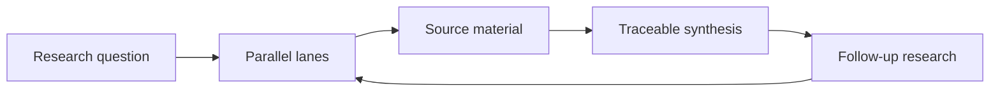

# Parallel Research

> A research workspace that turns one question into parallel lines of inquiry, then brings the evidence back into a traceable synthesis.

**Live app:** [theparallelresearch.com](https://theparallelresearch.com)

## Why it exists

Research is rarely a single answer. A useful investigation needs competing angles, source material, follow-up questions, and a way to return to the evidence after a summary is written.

Parallel Research makes that workflow explicit:

```text
Question → parallel research lanes → source material → synthesis → follow-up research
```

## What I built

- A research board for exploring a question through several independent lanes
- Source-aware output that keeps conclusions connected to supporting material
- Follow-up research without losing the original question or prior work
- Separate web and API services for the research workspace

The product is a research workspace, not a one-shot chat interface: research stays available to inspect, extend, and reuse.

## Architecture



More detail: [research workflow](docs/research-workflow.md).

## Public portfolio scope

This is the public portfolio repository for Parallel Research. The production application remains private.

Public here:

- Product workflow and architecture
- Feature-level implementation approach
- Sanitized examples and technical decisions

Private by design:

- Production source code and deployment configuration
- Provider credentials and operational prompts
- User data, research records, and evaluation assets

No license is included intentionally. The materials are available for review, not for reuse or redistribution.

## Status

Active prototype. The research workflow and interface are being refined through product use.
