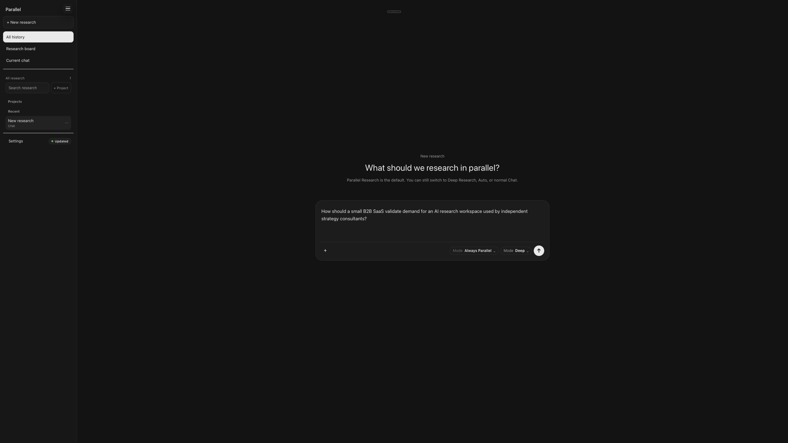
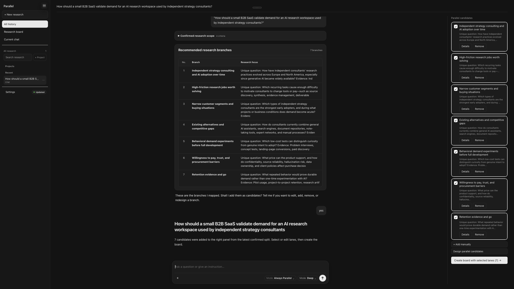
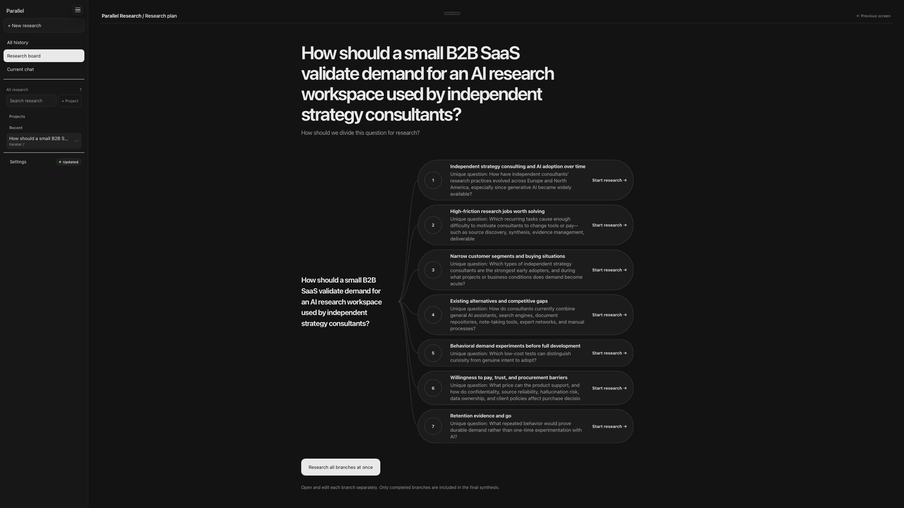
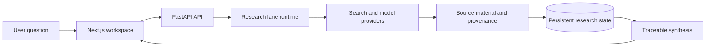

# Parallel Research

> A research workspace that turns one question into parallel lines of inquiry, then brings the evidence back into a traceable synthesis.

**Live app:** [theparallelresearch.com](https://theparallelresearch.com)



*Begin with one question and select the research mode and depth.*

## The problem

Most AI research ends as a disposable answer in a chat thread. That makes it difficult to compare competing angles, return to a useful source, deepen one part of an investigation, or understand why a final conclusion was written.

Parallel Research treats research as a reusable workspace rather than a one-shot response. It keeps the question, each research path, the material collected, and the final synthesis connected.

## The workflow

```text
Question → parallel research lanes → source material → synthesis → follow-up research
```

1. Start with one research question.
2. Split it into independent lanes that explore distinct perspectives.
3. Read each lane's findings with its collected material.
4. Select what belongs in a synthesis without overwriting the underlying work.
5. Deepen a promising lane and attach that work back to its parent.

The useful output is not only a summary. It is a summary that can still be inspected, challenged, and extended.

## Product flow

### 1. Select research candidates



### 2. Inspect the connected research board



## Product principles

| Principle | Product consequence |
| --- | --- |
| Preserve the research | A synthesis never replaces the underlying lane. |
| Preserve the evidence path | Findings remain connected to collected source material. |
| Make branching visible | Parallel and deep research have an explicit parent-child structure. |
| Put the result first | The interface leads with findings; sources and verification remain available on demand. |
| Separate a source from a tool | A search provider is execution metadata, not evidence the user can inspect. |

## What I built

- A research board for exploring one question through several independent lanes
- Persistent lane state, so each investigation can continue without collapsing into a single chat stream
- Source-aware research output with material and provenance connected to findings
- Deep research that remains attached to the lane from which it originated
- Selective synthesis and verification flows for turning research into defensible writing material
- A separately deployed Next.js client and FastAPI research service

## Architecture at a glance



- [Product walkthrough](docs/research-workflow.md)
- [Architecture and reliability](docs/architecture.md)
- [Sanitized implementation examples](examples/README.md)

## Public portfolio scope

This is the public portfolio repository for Parallel Research. The production application remains private.

| Included here | Kept private |
| --- | --- |
| Product workflow, UX rationale, and system architecture | Production source code and deployment configuration |
| Feature-level implementation decisions | Provider credentials, operational prompts, and environment values |
| The live product link | User data, research records, and evaluation assets |

No license is included intentionally. These materials are available for review, not for reuse or redistribution.

## Status

Active prototype. The workflow and interface are refined through product use.
