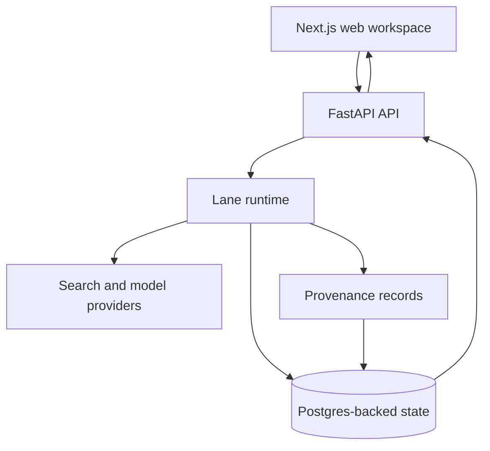

# Architecture and reliability

## System boundary

The production application is split into a web workspace and a research API. This keeps the interaction layer separate from long-running research, persistence, and provider calls.

## Execution model

- A research lane has its own thread state and collected material.
- Provider calls run behind a bounded concurrency limit and a timeout, so one stalled lane does not block every other lane.
- Research output and source material travel separately: generated prose stays readable while source and provenance data remain structured.
- The client receives streaming updates for responsive long-running research.

## Evidence model

The system separates three things that are often conflated:

| Layer | Meaning |
| --- | --- |
| Provider | The service used to search or generate. It is internal execution metadata. |
| Source material | A user-inspectable title, URL, and excerpt collected during research. |
| Provenance | The links between source material, extracted units, claims, and a research run. |

This distinction prevents a provider name from being presented as evidence and gives the product a durable path from a claim back to its supporting material.

## Failure boundaries

- A provider timeout clears the pending state instead of leaving the workspace blocked.
- A failed research call can fall back to a local planning/candidate flow so the user can continue shaping the investigation.
- Persistent state is preferred for recovery across restarts; a bounded in-memory fallback keeps the service usable when persistent checkpointing is unavailable.
- Credentials, deployment configuration, user records, and raw operational data are not part of this public repository.

## Deployment

The web and API services deploy independently. The public product is served at [theparallelresearch.com](https://theparallelresearch.com). This portfolio repository deliberately contains no deployment secrets or environment-specific configuration.
